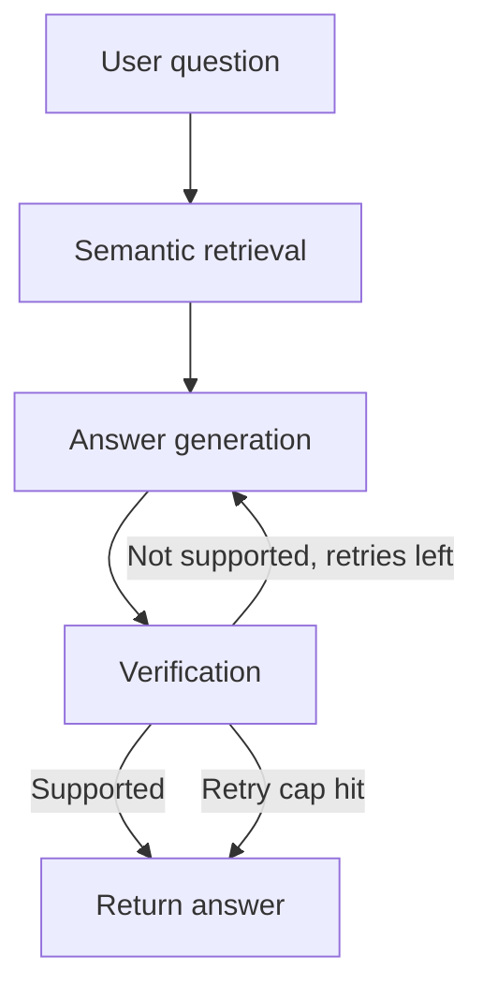

# 🛰️ ASTRA — Self-Correcting RAG Research Assistant

> A Retrieval-Augmented Generation system that searches, retrieves, and answers questions from academic paper abstracts on arXiv — and checks its own answers before returning them.

---

## 📌 Table of Contents

1. [Project Overview](#-project-overview)
2. [Why This Project Exists](#-why-this-project-exists)
3. [Tech Stack & Why Each Tool Was Chosen](#-tech-stack--why-each-tool-was-chosen)
4. [System Architecture — The Big Picture](#-system-architecture--the-big-picture)
5. [File Structure](#-file-structure)
6. [Complete Pipeline Walkthrough](#-complete-pipeline-walkthrough)
7. [Every Function Explained](#-every-function-explained)
8. [Setup & Installation](#-setup--installation)
9. [Example Input & Output](#-example-input--output)
10. [Design Decisions & Tradeoffs](#-design-decisions--tradeoffs)
11. [Known Limitations](#-known-limitations)
12. [Future Enhancements](#-future-enhancements)

---

## 🧠 Project Overview

ASTRA is a RAG (Retrieval-Augmented Generation) system that lets you ask questions about academic research and get answers grounded in real, retrieved paper abstracts — not the AI's own memory. What makes it different from a basic "chat with your papers" project is a **verification step**: after generating an answer, a second AI call independently checks whether that answer is actually supported by the retrieved text. If it isn't, the system automatically retries with a refined search — up to twice — before honestly returning its best answer.

The core design goal: **never let the system confidently state something its sources don't actually support.**

---

## 💡 Why This Project Exists

Generic AI chatbots answer research questions from their own training data — which means they can hallucinate specific facts, misattribute findings, or state things confidently that are simply wrong. In any serious research context, that's a real problem, not a minor inconvenience.

ASTRA addresses this by:
- Only answering from **actually retrieved** text, not general AI knowledge
- **Independently fact-checking its own output** against those sources before returning it
- Being **honest when it doesn't know** rather than filling gaps with plausible-sounding guesses

---

## 🛠 Tech Stack & Why Each Tool Was Chosen

| Tool | Purpose | Why This and Not Something Else |
|---|---|---|
| **Python** | Core language | Standard for AI/ML work, huge ecosystem |
| **FastAPI** | Web API framework | Async-friendly, automatic docs (`/docs`), minimal boilerplate compared to Flask |
| **LangGraph** | Orchestrates the self-correction loop | Regular LangChain chains only go in a straight line; LangGraph supports **conditional loops** — essential for "retry if unsupported" logic |
| **Groq (LLaMA 3.3 70B)** | LLM for generation and verification | Free tier, very fast inference, strong enough for both answering and fact-checking |
| **sentence-transformers (`bge-small-en-v1.5`)** | Embedding model | Runs locally, free, no API cost; BGE is specifically trained for retrieval tasks (as opposed to general-purpose embedding models) |
| **ChromaDB** | Vector database | Simpler than FAISS/Qdrant for a project this size — built-in persistence and metadata filtering with far less setup code |
| **arXiv API** | Data source | Free, official, no scraping — but abstracts only (see Design Decisions) |
| **python-dotenv** | Secrets management | Keeps API keys out of source code and git history |
| **Docker** | Containerization | Makes the app runnable identically anywhere, not just "on my machine" |

---

## 🏗 System Architecture — The Big Picture

User Question
│
▼
┌─────────────────────────────────────────┐
│ STAGE A: Router (implicit) │
│ Question passed directly to retrieval │
└─────────────────┬────────────────────────┘
│
▼
┌─────────────────────────────────────────┐
│ STAGE B: Semantic Retrieval │
│ Question → embedding → search Chroma │
│ → top-k most similar stored chunks │
└─────────────────┬────────────────────────┘
│
▼
┌─────────────────────────────────────────┐
│ STAGE C: Answer Generation │
│ Retrieved chunks + question → LLM │
│ → draft answer │
└─────────────────┬────────────────────────┘
│
▼
┌─────────────────────────────────────────┐
│ STAGE D: Verification │
│ Draft answer + same chunks → LLM │
│ → "is this answer actually supported?" │
└─────────────────┬────────────────────────┘
│
┌─────────┴──────────┐
│ │
Supported? Not supported?
│ │
▼ ▼
Return answer Retry Stage C→D
(max 2 attempts)
│
▼
Return best answer,
honestly, either way


**The crucial insight:** unlike the Academic Advisor project (where Python did the hard logic and the LLM only narrated), here the LLM does both the answering *and* the checking — but as two **separate, independent calls** with different, narrow instructions. The verifier is never told "you just wrote this, was it good?" — it's given the answer and the sources fresh, and asked a strict, narrow yes/no question. This separation is what keeps the check honest instead of the AI just agreeing with itself.

---

## 📁 File Structure



**The crucial insight:** unlike the Academic Advisor project (where Python did the hard logic and the LLM only narrated), here the LLM does both the answering *and* the checking — but as two **separate, independent calls** with different, narrow instructions. The verifier is never told "you just wrote this, was it good?" — it's given the answer and the sources fresh, and asked a strict, narrow yes/no question. This separation is what keeps the check honest instead of the AI just agreeing with itself.

---

## 📁 File Structure

Astra/
├── main.py          # FastAPI app, /ask and /ingest endpoints
├── graph.py          # LangGraph pipeline: generate → verify → retry
├── rag.py            # Original single-pass RAG (superseded, kept for reference)
├── llm.py             # ask_ai() — wraps the Groq API call
├── embeddings.py       # get_embedding() — BGE embeddings
├── vectorstore.py       # add_chunk(), search() — Chroma operations
├── ingestion.py          # fetch_papers(), chunk_text(), ingest_papers()
├── config.py              # Loads GROQ_API_KEY from .env
├── data/chroma/            # Auto-generated vector DB (gitignored)
├── requirements.txt
├── Dockerfile
└── LICENSE

---

## 🔬 Complete Pipeline Walkthrough

### Stage A — Ingestion (`/ingest`, run before asking questions)

**What it does:** Takes a topic string (e.g., `"quantum computing"`), fetches matching paper abstracts from arXiv, breaks each abstract into overlapping ~100-word chunks, converts each chunk into an embedding, and stores it in Chroma with metadata (title, URL, chunk position).

**Why chunking matters:** A full abstract's embedding blurs together multiple ideas into one vector, making search less precise. Smaller chunks give sharper, more targeted retrieval — and the AI gets more focused context instead of a wall of text.

**Why overlap:** Each new chunk repeats the last ~20 words of the previous one, so a sentence or idea sitting right at a chunk boundary doesn't get cut in half and lost.

---

### Stage B — Semantic Retrieval (inside `/ask`)

**What it does:** Converts the user's question into an embedding using the *same* BGE model used during ingestion, then asks Chroma for the stored chunks whose embeddings are closest in meaning — not closest in exact wording.

**Why this matters:** A question like "how do you move a spacecraft between two orbits" correctly retrieves a chunk about "Hohmann transfer orbits" even though the words don't overlap at all — because the *meaning* is close. This was verified directly during development (see commit history).

---

### Stage C — Answer Generation

**What it does:** Combines the retrieved chunks into one context block, builds a prompt instructing the AI to answer using *only* that context and to admit honestly if the context doesn't contain the answer, and sends it to Groq.

**Why the explicit "say so honestly" instruction matters:** This is the first line of defense against hallucination — before verification even runs. It was directly tested: asking about "the capital of France" (completely outside the stored papers) correctly returned "the context doesn't contain the answer" instead of an invented response.

---

### Stage D — Verification (the differentiator)

**What it does:** Takes the generated answer and the *same* source chunks, and asks the AI a completely separate, narrow question: "is this answer fully supported by this context? Respond with only yes or no." The response is converted into a boolean (`is_supported`).

**Why a separate call, not the same conversation:** If you asked the same AI "was your last answer correct?" in the same context, it tends to just agree with itself. A fresh call with only the raw answer + raw sources, and strict instructions, produces a more genuinely independent check.

**What "supported" actually means here:** the verifier checks *consistency with the retrieved text*, not real-world factual accuracy. An honest "I don't know" answer correctly passes verification, because it's consistent with context that doesn't contain the answer. This was directly observed during testing and is an intentional, documented scope of what verification means in this system.

---

### Stage E — Conditional Retry Loop

**What it does:** If `is_supported` is `False` and the retry count hasn't hit the cap (2 attempts), the graph loops back to Stage C with the same question, generating a new attempt. If supported, or if the retry cap is reached, the graph ends and returns the current answer.

**Why a retry cap, not unlimited retries:** without a limit, a question the system genuinely can't answer from its data would loop forever. The cap guarantees the system always terminates and returns *something*, even if imperfect — this was a deliberate fix added after building the initial loop, once the infinite-loop risk was identified.

---

## 🔧 Every Function Explained

### `embeddings.py`

#### `get_embedding(text: str) → list[float]`
**What:** Converts any string into a list of ~384 numbers representing its meaning, using the `bge-small-en-v1.5` model running locally.

**Why BGE over MiniLM:** BGE was trained specifically for retrieval tasks (matching questions to relevant passages), which is exactly what this project does — general-purpose embedding models are slightly less precise for this specific job.

---

### `vectorstore.py`

#### `add_chunk(chunk_id: str, text: str, metadata: dict) → None`
**What:** Embeds a piece of text and stores it in Chroma alongside its original text and metadata (paper title, URL, chunk index).

**Why `chunk_id` must be unique:** Chroma uses it to identify each entry — reusing an ID would overwrite previous data instead of adding new data.

#### `search(query: str, top_k: int = 3) → dict`
**What:** Embeds the query and asks Chroma for the `top_k` closest stored chunks by embedding distance.

**Why `top_k` as a parameter with a default:** callers can request more or fewer results without changing the function itself — `search("question")` uses 3 by default, `search("question", top_k=5)` overrides it.

---

### `ingestion.py`

#### `fetch_papers(query: str, max_results: int = 5) → list`
**What:** Calls the arXiv API and returns paper objects (title, abstract, URL, published date) matching the query, sorted by relevance.

**Why relevance sort, not date sort:** date-sorted results returned topically unrelated papers during testing (e.g., a "hypersonic propulsion" search returning a humanoid-robot paper) since arXiv's date sort ignores topical fit entirely.

**Known behavior, not a bug:** arXiv's search is keyword-based, not semantic — so results can be loosely related. This is expected; ASTRA's own embedding-based `search()` provides the actual precision layer on top of these candidate papers.

#### `chunk_text(text: str, chunk_size: int = 100, overlap: int = 20) → list[str]`
**What:** Splits text into overlapping word-count chunks. See Stage A above for why chunking and overlap matter.

#### `ingest_papers(query: str, max_results: int = 5) → int`
**What:** The full pipeline function — calls `fetch_papers()`, then `chunk_text()` on each paper's abstract, then `add_chunk()` for every resulting chunk. Returns the total number of chunks saved.

**Why unique chunk IDs use `{arxiv_id}_chunk_{index}`:** guarantees no collision between chunks from different papers or different positions within the same paper.

---

### `llm.py`

#### `ask_ai(question: str) → str`
**What:** Sends a single message to Groq's `llama-3.3-70b-versatile` model and returns the text response.

**Why this is a separate file from `rag.py`/`graph.py`:** keeps the raw "talk to the LLM" logic isolated from the RAG-specific logic (prompt building, context injection) — a clean separation of concerns.

---

### `graph.py`

#### `generate_node(state) → state`
**What:** Runs Stage B (retrieval) and Stage C (generation), storing the retrieved chunks and the draft answer into the graph's shared state. Also increments `loop_count`.

#### `verify_node(state) → state`
**What:** Runs Stage D — checks the draft answer against the stored context chunks and sets `state["is_supported"]`.

#### `decide_next_step(state) → str`
**What:** The conditional logic — returns `"end"` if supported or the retry cap is reached, otherwise `"retry"`. This return value is used by LangGraph's `add_conditional_edges` to decide which node runs next.

**Why this is a plain function, not a node:** it doesn't transform the state, it only makes a routing decision — LangGraph treats these as a distinct concept (a "conditional edge") from a "node."

---

### `main.py`

#### `POST /ingest`
**What:** Accepts `{"topic": str, "max_results": int}`, calls `ingest_papers()`, returns how many chunks were saved.

#### `POST /ask`
**What:** Accepts `{"query": str}`, invokes the compiled LangGraph pipeline, and returns the final answer along with `supported` (bool) and `attempts` (loop count) — deliberately exposing this metadata so API consumers can see whether an answer was verified, not just trust it blindly.

---

## ⚙️ Setup & Installation

### 1. Clone the Repository
```bash
git clone https://github.com/BiswasNehaa/Astra.git
cd Astra
```

### 2. Create a Virtual Environment
```bash
python -m venv .venv
.venv\Scripts\activate    # Windows
```

### 3. Install Dependencies
```bash
pip install -r requirements.txt
```

### 4. Set Up API Keys
Create a `.env` file:
GROQ_API_KEY=your_groq_api_key_here

Get a free key at [console.groq.com](https://console.groq.com)

### 5. Run Locally
```bash
uvicorn main:app --reload
```
Visit `http://127.0.0.1:8000/docs` to test endpoints interactively.

### 6. Run with Docker
```bash
docker build -t astra .
docker run -p 8000:8000 --env-file .env astra
```

---

## 📥 Example Input & Output

**Step 1 — Ingest papers on a topic:**
```json
POST /ingest
{"topic": "quantum computing", "max_results": 5}
```
```json
{"chunks_saved": 7}
```

**Step 2 — Ask a question:**
```json
POST /ask
{"query": "How do you move a spacecraft between two orbits?"}
```
```json
{
  "answer": "A spacecraft can be moved between two circular orbits using a Hohmann transfer orbit, which involves two engine burns.",
  "supported": true,
  "attempts": 1
}
```

---

## 🤔 Design Decisions & Tradeoffs

| Decision | Alternative Considered | Why This Choice Won |
|---|---|---|
| Chroma over Qdrant/FAISS | Qdrant (separate server), FAISS (lower-level) | Built-in persistence and metadata filtering, far less setup code for a project this size |
| BGE over MiniLM embeddings | `all-MiniLM-L6-v2` | BGE is trained specifically for retrieval tasks, a better fit for RAG specifically |
| Groq over OpenAI/Claude API | Paid APIs | Free tier, fast inference, zero cost pressure while learning and iterating |
| Verification as a separate LLM call | Self-critique in the same conversation | A fresh call with only raw inputs avoids the AI simply agreeing with its own prior output |
| Retry cap of 2 | Unlimited retries | Guarantees termination; prevents infinite loops on genuinely unanswerable questions |
| **Abstracts only, not full PDF text** | Parsing full PDF text | Abstracts are always available via the arXiv API with zero parsing complexity or failure modes; sufficient for a "research discovery and comparison" use case. **This is a real scope boundary, documented honestly below, not a hidden gap.** |
| Python 3.11 in Docker, not 3.13 | Matching local Python version | `chroma-hnswlib` and other packages lacked pre-built installers for 3.13 at the time, forcing slow/broken source compilation; 3.11 has full pre-built wheel support |
| CPU-only PyTorch in Docker | Default PyTorch install | Default install pulls multi-GB NVIDIA CUDA libraries never used in this containerized, GPU-less deployment — CPU-only build cut image size dramatically and fixed unstable, timing-out builds |

---

## ⚠️ Known Limitations

- **Abstracts only, not full papers.** Ingestion pulls arXiv abstracts (150-250 words), not full PDF text. ASTRA can answer questions about a paper's main claims, methods at a high level, and general findings — but not fine-grained details (exact numbers, full methodology, limitations sections) that only appear in the full paper body. Full-text PDF ingestion is tracked as an open contribution issue.
- **Verification checks consistency, not ground truth.** The verifier confirms an answer matches the retrieved context — it does not independently confirm the retrieved context itself is factually correct. An honestly-worded "I don't know" answer correctly passes verification.
- **Free-tier deployment is memory-constrained.** Local embedding model + PyTorch typically exceed the 512MB RAM limit on Render's free tier. Fully verified working locally and in Docker; production deployment would need a paid instance or a hosted embeddings API instead of a locally-run model.
- **No per-user rate limiting yet** on the `/ask` endpoint — relies on Groq's own free-tier limits.
- **arXiv's own search is keyword-based, not semantic** — candidate papers pulled by `fetch_papers()` can be loosely topically related; ASTRA's own embedding search provides the actual precision layer on top.

---

## 🌟 Future Enhancements

- **Full PDF ingestion** — parse complete paper text, not just abstracts, for deeper Q&A
- **Hosted embeddings API** — remove the local model's memory footprint, enabling free-tier deployment without hitting RAM limits
- **Per-user rate limiting** on `/ask`
- **Citation formatting** — return which specific chunk/paper supported each part of an answer, not just a binary "supported" flag
- **Multi-paper comparison mode** — "compare the approach in paper A vs paper B"
- **Persistent, larger-scale vector storage** — migrate from Chroma to Qdrant for larger paper corpora
- **Unit test suite** — no automated tests exist yet

---

## 🔐 Security Notes

- API keys are stored in `.env` and never hardcoded or committed to git (verified via `.gitignore` and confirmed with `git ls-files` during development)
- `.dockerignore` excludes `.venv`, `.git`, and local database files from the Docker build context

---

*Built with FastAPI · LangGraph · Groq (LLaMA 3.3 70B) · sentence-transformers (BGE) · ChromaDB · Docker*
